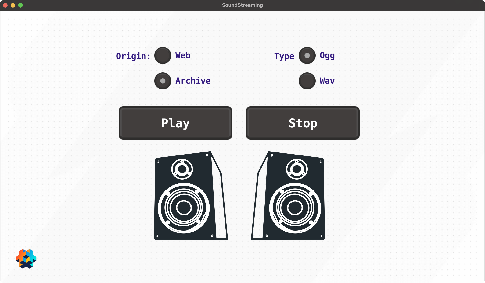

# Sound streaming example

This example shows how to stream sounds from either the archive (the base game bundle) or the web.

For supporting loading from the web, start a web server where the files uner the [web](./web) folder is available.

E.g. starting a local server:

  $ (cd sounds && python -m RangeHTTPServer)

You can of course also change the url in main.script, to somethin of your choosing (defaults to http://localhost:8000)

Credits:

* mary-had-a-little-lamb-loop.ogg CC0 by punisherdan
  * Link: https://freesound.org/people/punisherdan/sounds/511253/

* Other ogg/wav files from
  * https://onlinetestcase.com/ogg-file/
  * https://onlinetestcase.com/wav-file/

